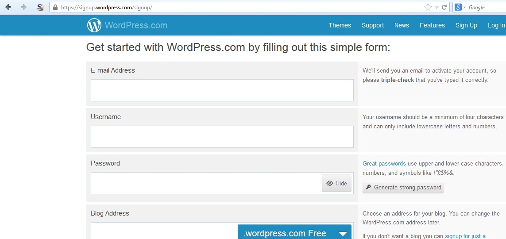

# Testar Processo de Registro de Usuario

|ID          |
|------------|
|WSTG-IDNT-02|

## Resumo

Alguns sites oferecem um processo de registro de usuário que automatiza (ou semi-automatiza) o provisionamento de acesso ao sistema para os usuários. Os requisitos de identidade para acesso variam desde identificação positiva até nenhum, dependendo dos requisitos de segurança do sistema. Muitos aplicativos públicos automatizam completamente o processo de registro e provisionamento porque o tamanho da base de usuários torna impossível gerenciar manualmente. No entanto, muitos aplicativos corporativos provisionam usuários manualmente, então este caso de teste pode não ser aplicável.

## Objetivos do Teste

- Verificar se os requisitos de identidade para o registro de usuários estão alinhados com os requisitos de negócios e segurança.
- Validar o processo de registro.

## Como Testar

Verifique se os requisitos de identidade para o registro de usuários estão alinhados com os requisitos de negócios e segurança:

1. Qualquer pessoa pode se registrar para obter acesso?
2. Os registros são revisados por um humano antes do provisionamento, ou são concedidos automaticamente se os critérios forem atendidos?
3. A mesma pessoa ou identidade pode se registrar várias vezes?
4. Os usuários podem se registrar para funções ou permissões diferentes?
5. Que comprovação de identidade é necessária para que um registro seja bem-sucedido?
6. As identidades registradas são verificadas?

Valide o processo de registro:

1. As informações de identidade podem ser facilmente forjadas ou falsificadas?
2. A troca de informações de identidade pode ser manipulada durante o registro?

### Exemplo

No exemplo do WordPress abaixo, o único requisito de identificação é um endereço de e-mail acessível ao registrante.

\
*Figura 4.3.2-1: Página de Registro do WordPress*

Em contraste, no exemplo do Google abaixo, os requisitos de identificação incluem nome, data de nascimento, país, número de telefone celular, endereço de e-mail e resposta de CAPTCHA. Embora apenas dois destes possam ser verificados (endereço de e-mail e número de celular), os requisitos de identificação são mais rigorosos do que os do WordPress.

\
*Figura 4.3.2-2: Página de Registro do Google*

## Remediação

Implemente requisitos de identificação e verificação que correspondam aos requisitos de segurança das informações que as credenciais protegem.

## Ferramentas

Um proxy HTTP pode ser uma ferramenta útil para testar esse controle.

## Referências

[User Registration Design](https://mashable.com/2011/06/09/user-registration-design/)