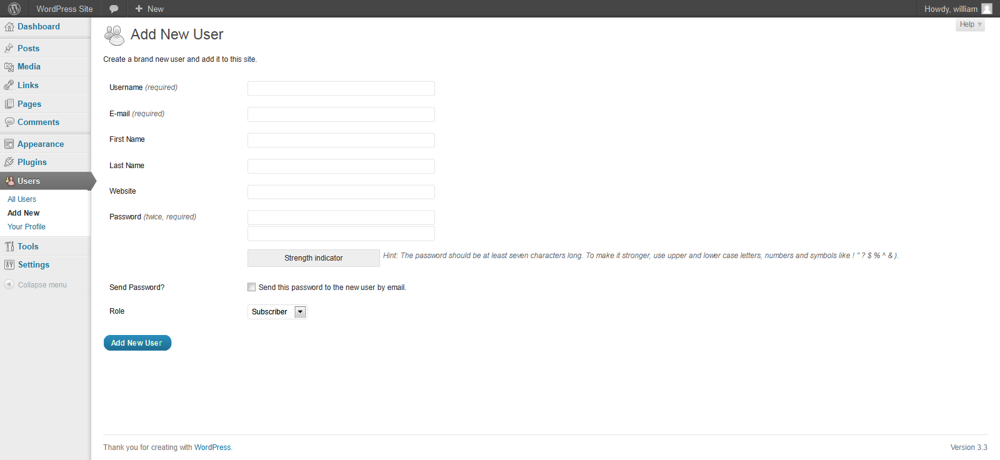

# Testar Processo de Provisionamento de Conta

|ID          |
|------------|
|WSTG-IDNT-03|

## Resumo

O provisionamento de contas oferece uma oportunidade para um invasor criar uma conta válida sem a aplicação adequada do processo de identificação e autorização.

## Objetivos do Teste

- Verificar quais contas podem provisionar outras contas e de que tipo.

## Como Testar

Determine quais funções podem provisionar usuários e que tipo de contas elas podem provisionar.

- Existe alguma verificação, avaliação e autorização de solicitações de provisionamento?
- Existe alguma verificação, avaliação e autorização de solicitações de desprovisionamento?
- Um administrador pode provisionar outros administradores ou apenas usuários?
- Um administrador ou outro usuário pode provisionar contas com privilégios superiores aos seus próprios?
- Um administrador ou usuário pode se desprovisionar?
- Como são gerenciados os arquivos ou recursos de propriedade do usuário desprovisionado? Eles são excluídos? O acesso é transferido?

### Exemplo

No WordPress, apenas o nome do usuário e o endereço de e-mail são necessários para provisionar o usuário, como mostrado abaixo:

\
*Figura 4.3.3-1: Adicionar Usuário no WordPress*

O desprovisionamento de usuários requer que o administrador selecione os usuários a serem desprovisionados, selecione Excluir no menu suspenso (circulado) e, em seguida, aplique essa ação. O administrador é então apresentado com uma caixa de diálogo perguntando o que fazer com as postagens do usuário (excluir ou transferir).

\
*Figura 4.3.3-2: Autenticação e Usuários no WordPress*

## Ferramentas

Embora a abordagem mais completa e precisa para concluir este teste seja fazê-lo manualmente, ferramentas de proxy HTTP também podem ser úteis.